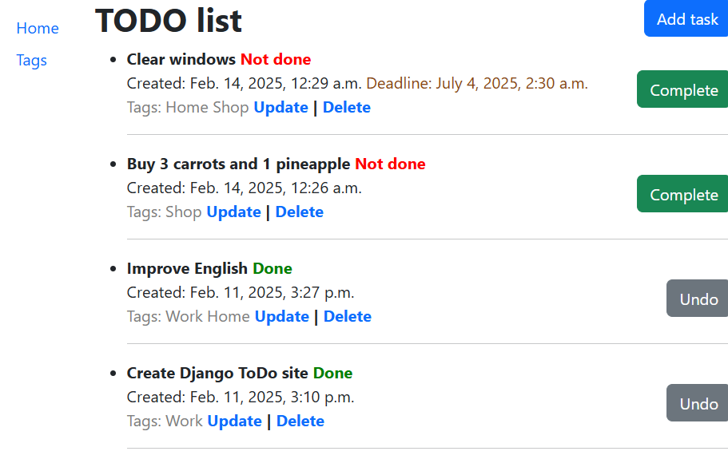
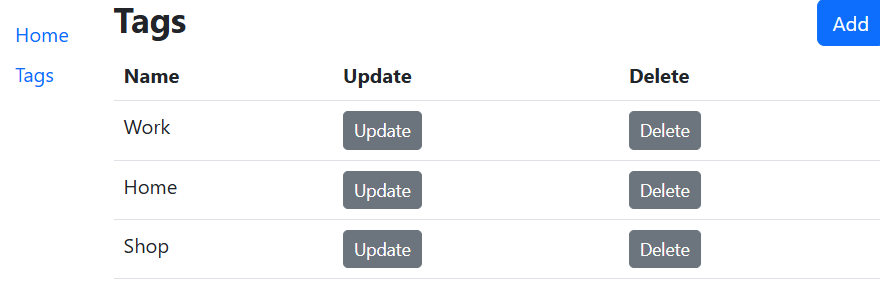

# To-Do List App - Mate Django practice

## Installation

1. Clone the repository:  
   ```sh
   git clone https://github.com/Sonemon/py-todo-list-mate-django-practice/tree/main
   ```
2. Install dependencies:
   ```shell
   pip install -r requirements.txt
   ```
3. Apply migrations:
   ```shell
   python manage.py makemigrations
   python manage.py migrate
   ```
4. Run the project:
   ```shell
   python manage.py runserver
   ```
5. Now, open http://127.0.0.1:8000/ in your browser to use the app.

## Screenshots
### ToDo list


### Tags

